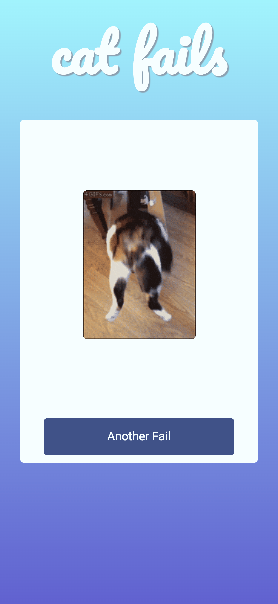

#Cat Fail Generator.

The Cat Fail Generator is a react app that calls the Giphy API and fetches a gif of a failing cat.

This project is very clean and simple, demonstrating an asynchronous call to an api using `async await`.

The react app is quite simple, but required setting the state within an asynchronous function and calling this function on `componentDidMount()` and on the button click. Also, as the gif is fetched from the api, I had to add a loading icon onto the screen to show the user that the button click was successful and the gif is on the way.

If I were to rewrite this function now I would most likely use a Hook, rather than class as I would be able to avoid needing to worry about the component lifecycle and `componentDidMount()`, with the use of `useEffect` instead.
