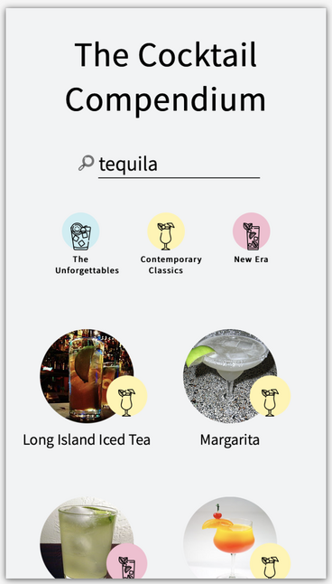
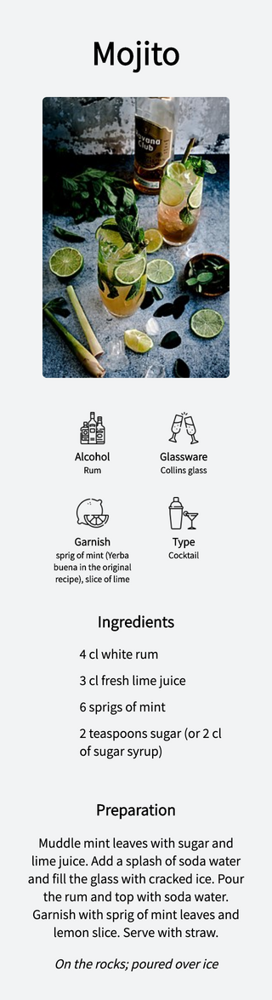

#Cocktails Project (Part Two).

Once I had the data for the cocktails, I could start on the frontend piece. I used react as I could have a dynamic component to create the cocktail details page.

I used hooks to control the states of the search term and the cocktail array, which should render on the click of the category logos and on submission of the search form.

One the details page itself, the cocktail details are filtered from the original array passed through the param of the router. This works for such a small project, but would run into problems when concurrency or a larger array is considered (if there were half a million products to filter through, this would be a poor UX). I could remedy this by using graphql or creating a context to pass between pages.

I wanted to keep the design simple, and used css grid to control the layout, which made designing the responsiveness much easier.

If you'd like to take a look, The Cocktails Compendium can be found [here](https://cocktailscompendium.netlify.app).
