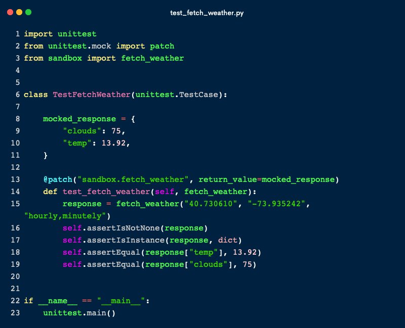

#TDD in Python and JS.

Test Driven Development is a concept I've been trying to my head around for quite some time. I understand the motive; instead of coding first, TDD shifts the focus to writing a failing test first, then gradually implementing code until the test is green. This approach leads to fewer mistakes in the long run and ensures that problems remain easy to spot as complexity increases.

Where I have struggled with the concept is understanding what, precisely, to test. To that end, I've worked on a couple example in JS and python to clarify the concept in my head.

Say I need to create a function called `orderTotal`, which takes the cost of products in a basket and sums the total, including shipping if required.

Before writing the functions I began with the tests.

The above shows the test in its complete form, in reality I started with one test at a time, and then added code until that test passed, before moving on. For each bit of complexity I wrote the test first before adding the code, knowing that if I made a change accidentally making a mistake, a previously passing would then fail and I could revise.

For API requests, testing becomes a little more complex. The idea of testing that it is quite, and constantly calling an API just to test the response is slow, and costly if I'm charged for the requests. This is where mocking comes in, instead of testing the a real GET request, we fake the response and use this as the data to test against.

As an example, for this python function, `fetch_weather`, which fetches products from the weather from a certain Longitude and Latitude.

In order to test this function, we can mock the response using `mock` and `patch` from the unittest library. This is where python decorators come in very handy, as we can decorate our actual function and simply divert the response.

Perhaps a more useful method in python is `pytest-vcr`, which works by creating 'cassettes' of api calls when a decorator is added to a test. This then calls the api for the first run, and stores the call in a cassette for future tests to mock against. This process feels much simpler as the test can be kept simple.

After spending some time looking into TDD, I feel more confident with the methodology and will look to implement this approach in all projects going forward.
